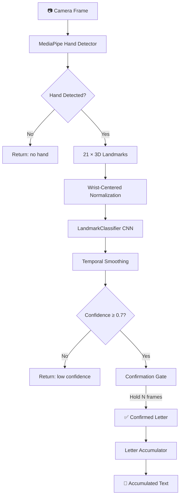
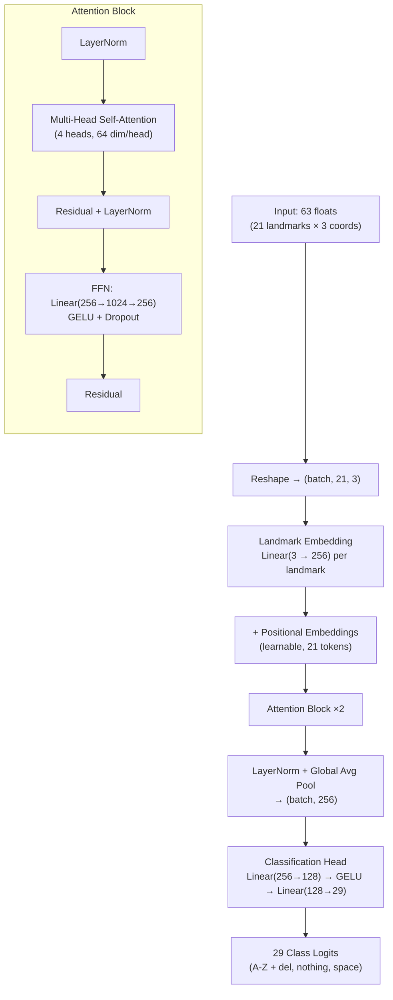

# 🖐️ ASL Model API — Architecture
**Real-Time American Sign Language Fingerspelling Recognition**

The ASL Model API is a multi-stage inference pipeline that takes a raw camera frame and produces recognized text. It doesn't just classify hand shapes; it **extracts** 3D landmarks using MediaPipe, **classifies** them with an attention-based neural network, and **stabilizes** predictions with temporal smoothing and confirmation logic.

---

## 🏗️ Architecture Overview

The system operates across five distinct processing stages to take a camera frame from capture to confirmed text:



---

## 🧩 Core Components

1. **🖐️ MediaPipe Hand Detector**: Extracts 21 3D hand landmarks (x, y, z) from a BGR camera frame. Supports both legacy and new Tasks API for broad compatibility.
2. **📐 Landmark Normalizer**: Centers all landmarks on the wrist (landmark 0) and scale-normalizes using the middle-finger distance — making predictions lighting and position invariant.
3. **🧠 LandmarkClassifier (Attention)**: A transformer-style neural network (~500K params) that treats each of the 21 landmarks as a token, applying multi-head self-attention to capture finger-to-finger spatial relationships.
4. **⏳ Temporal Smoother**: Weighted voting across the last N frames eliminates single-frame noise and stabilizes predictions during real-time use.
5. **✅ Confirmation Gate**: Requires the same letter to be predicted for N consecutive frames before it is "confirmed" — preventing accidental letter input.
6. **📝 Letter Accumulator**: Builds words and sentences from confirmed letters. Handles special tokens: `space` (word break), `del` (backspace), `nothing` (ignore).

---

## 🧠 Neural Network Architecture

Two model variants are available via the `create_model()` factory:

### Primary: LandmarkClassifier (Attention-based)



| Metric | Value |
|--------|-------|
| **Parameters** | ~500K |
| **Model Size** | ~2 MB |
| **Inference (GPU)** | < 50ms |
| **Inference (CPU)** | < 100ms |
| **Accuracy** | 95-99% on test set |

### Lite: LandmarkClassifierLite (Edge Deployment)

A simple MLP stack for faster inference on constrained hardware:

`Linear(63→256) → BN → GELU → Linear(256→128) → BN → GELU → Linear(128→64) → BN → GELU → Linear(64→29)`

---

## 📁 Module Breakdown

| Module | File | Purpose |
|--------|------|---------|
| **API Layer** | `api/main.py` | FastAPI app factory, CORS, lifespan (model loading/cleanup) |
| | `api/routes.py` | All endpoint handlers; delegates to `ASLPredictor` |
| | `api/schemas.py` | Pydantic request/response models |
| **Inference Engine** | `inference/predictor.py` | `ASLPredictor` — landmark extraction, normalization, classification, smoothing, confirmation. `LetterAccumulator` — text builder |
| | `inference/webcam_demo.py` | Standalone OpenCV demo for local testing |
| **Neural Network** | `models/landmark_classifier.py` | `MultiHeadAttention`, `LandmarkAttentionBlock`, `LandmarkClassifier`, `LandmarkClassifierLite`, `create_model()` factory |
| **Training** | `training/train.py` | Training loop with cosine scheduler, early stopping, label smoothing |
| | `training/evaluate.py` | Evaluation metrics, confusion matrix, per-class accuracy |
| | `training/augmentation.py` | Landmark-level data augmentation (rotation, scaling, noise) |
| **Configuration** | `config/config.py` | Dataclass configs: `DataConfig`, `ModelConfig`, `TrainingConfig`, `InferenceConfig`, `APIConfig` |

---

## 🚀 Request Lifecycle

### Phase 1: Input
Client sends a base64-encoded JPEG frame via `POST /predict`.

### Phase 2: Landmark Extraction
MediaPipe detects the hand and returns 21 (x, y, z) landmarks. If no hand is found, the API returns immediately.

### Phase 3: Normalization
Landmarks are centered on the wrist and scaled by the middle-finger distance — making input invariant to hand position, size, and camera distance.

### Phase 4: Classification
The normalized 63-float vector is passed through the attention-based classifier. Softmax produces per-class probabilities.

### Phase 5: Stabilization
Temporal smoothing (weighted vote over recent frames) + confirmation gate (hold for N frames) produce a stable, intentional letter.

### Phase 6: Response
```json
{
  "letter": "A",
  "confidence": 0.97,
  "hand_detected": true,
  "inference_time_ms": 23.4,
  "is_confirmed": true
}
```

---

## 🎯 Key Design Decisions

| Decision | Rationale |
|----------|-----------|
| **Landmarks, not raw images** | 63 floats vs 224×224×3 pixels = 1000× smaller input, faster inference, lighting-invariant |
| **Self-attention over MLP** | Captures finger-to-finger spatial relationships (e.g., thumb-pinky distance matters for 'Y') |
| **Temporal smoothing** | Single-frame noise is common; weighted voting stabilizes predictions |
| **Confirmation gate** | Prevents accidental letter input — user must hold a gesture steady |
| **Dual MediaPipe API** | Supports both legacy and new Tasks API for broader compatibility |
| **Factory pattern** | `create_model("attention" \| "lite")` allows swapping architectures without changing inference code |
