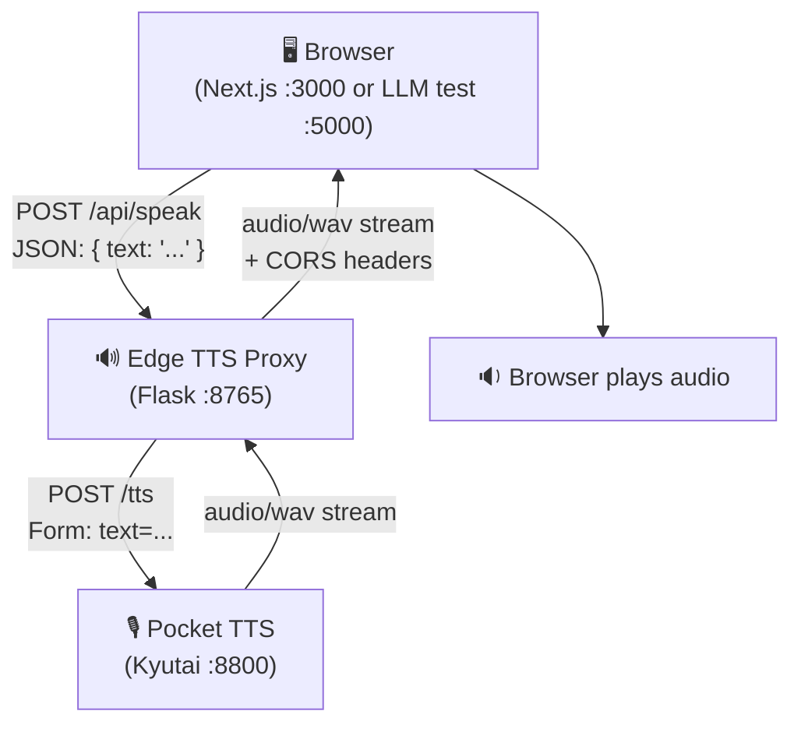
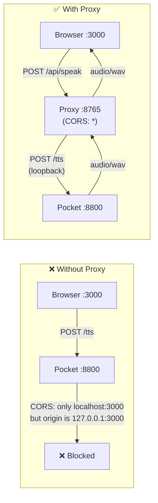
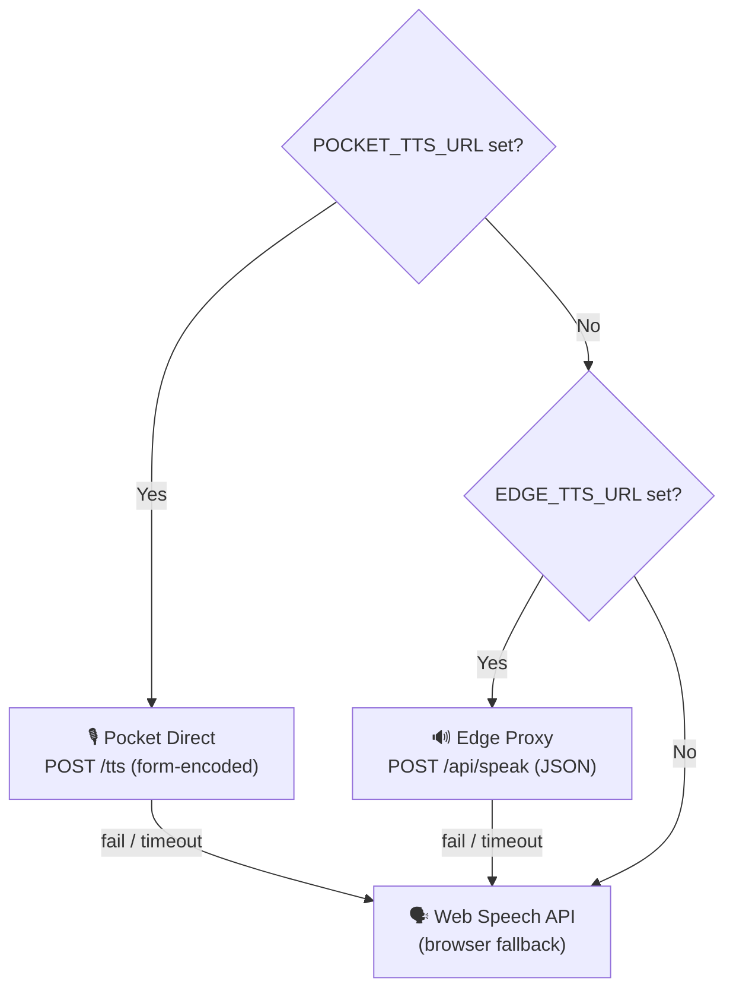

# 🔊 Edge TTS Proxy — Architecture
**A CORS-Friendly Gateway to Kyutai Pocket TTS**

The Edge TTS Proxy is a lightweight streaming relay that sits between the browser and Pocket TTS. It doesn't just forward requests; it **translates** JSON to form-encoded POST, **adds** permissive CORS headers, and **streams** audio chunks back to the browser in real-time — solving the CORS mismatch that blocks direct browser-to-Pocket communication.

---

## 🏗️ Architecture Overview

The proxy solves a single problem: Pocket TTS has a hardcoded CORS allowlist, but the browser may run on a different origin.



---

## 🧩 Core Components

1. **🔄 Request Translator**: Converts ergonomic JSON (`{"text": "Hello"}`) to Pocket's expected `application/x-www-form-urlencoded` format (`text=Hello`).
2. **🌐 CORS Gateway**: Adds permissive `Access-Control-Allow-Origin: *` headers, bypassing Pocket's restrictive allowlist. Configurable via `EDGE_TTS_CORS_ORIGINS` for production.
3. **📡 Stream Relay**: Proxies the audio response chunk-by-chunk (8KB) so the browser receives audio progressively — no buffering the entire WAV in memory.
4. **❤️ Health Probe**: `GET /health` pings upstream Pocket `GET /health` and reports reachability — useful for monitoring and debugging.

---

## 🤔 Why This Proxy Exists



| Problem | How the Proxy Solves It |
|---------|------------------------|
| Pocket CORS allowlist only includes `http://localhost:3000` | Proxy accepts `*` origins and forwards to Pocket on loopback |
| Browser uses `127.0.0.1` instead of `localhost` | Proxy normalizes — always calls Pocket via `127.0.0.1` |
| Pocket expects `multipart/form-data` | Proxy accepts JSON and converts to form POST |
| Jetson Chromium opens on LAN IP, not localhost | Proxy binds `0.0.0.0` so any LAN client can reach it |

---

## 🛡️ TTS Fallback Ladder (Full System)

The proxy is one layer in NovaCare's multi-tier speech stack. The browser `TTSService` follows this precedence:



---

## 📁 Module Breakdown

This service is intentionally minimal — a single file:

| Module | File | Purpose |
|--------|------|---------|
| **Proxy App** | `app.py` | Flask app: `/api/speak` (translate + stream), `/health` (upstream probe). ~80 lines. |
| **Dependencies** | `requirements.txt` | `flask`, `flask-cors`, `requests` |

---

## 🚀 Request Lifecycle

### Phase 1: Browser Request
Browser sends `POST /api/speak` with `{"text": "Hello world", "voice_url": "optional"}`.

### Phase 2: Translation
Proxy extracts `text` and optional `voice_url` from JSON body. Converts to form-encoded data: `text=Hello+world`.

### Phase 3: Upstream Forward
Proxy sends `POST http://127.0.0.1:8800/tts` with form data. Timeout: 30s connect, 120s read (configurable).

### Phase 4: Stream Response
Pocket generates speech and streams `audio/wav`. Proxy relays chunks (8KB each) back to the browser with:
```
Content-Type: audio/wav
Cache-Control: no-store
X-Accel-Buffering: no
```

### Phase 5: Browser Playback
Browser plays audio via `<audio>` element or `AudioContext`. On failure or timeout, falls back to Web Speech API.

---

## 🎯 Key Design Decisions

| Decision | Rationale |
|----------|-----------|
| **Single-file architecture** | The proxy does exactly one thing — no reason to over-engineer it |
| **Streaming, not buffering** | `iter_content(8KB)` means the browser starts hearing audio before Pocket finishes generating |
| **JSON → form translation** | Browser-friendly JSON input while maintaining Pocket's expected format |
| **Permissive CORS default** | `*` for dev; `EDGE_TTS_CORS_ORIGINS` env var for production lockdown |
| **No auth layer** | Proxy runs on the rover LAN (loopback or private network) — no external exposure |
