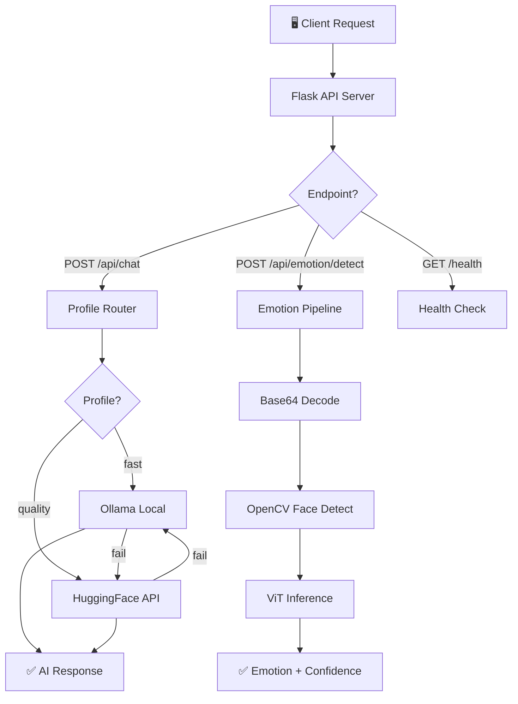
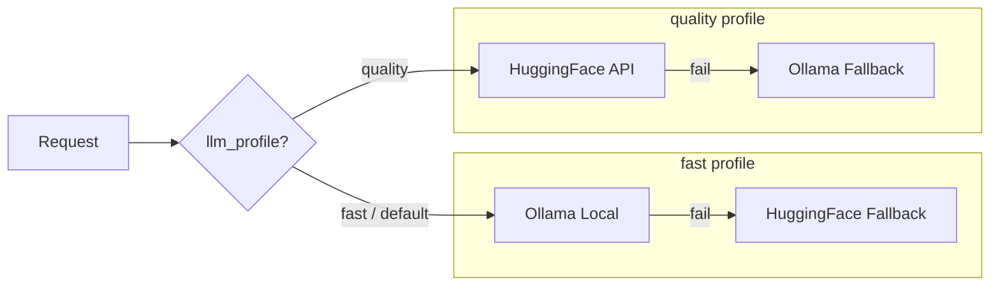
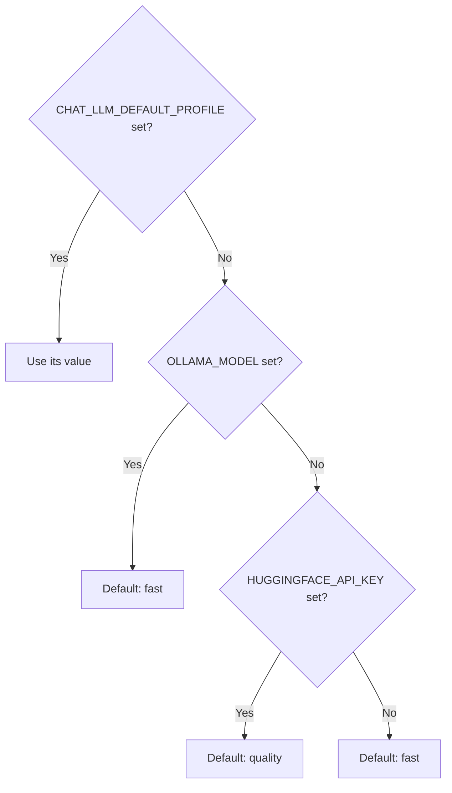
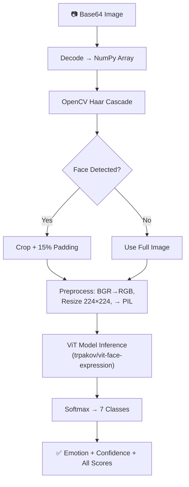

# 🤖 LLM Backend — Architecture
**Dual-Routed Conversational AI with Facial Emotion Detection**

The LLM Backend is a multi-capability Flask service that powers NovaBot's intelligence. It doesn't just forward messages to an LLM; it **routes** requests through a dual-backend system with automatic failover, **detects** facial emotions using a Vision Transformer, and **exposes** a unified API consumed by both the Next.js frontend and a bundled test page.

---

## 🏗️ Architecture Overview

The service operates two independent AI pipelines behind a single Flask API:



---

## 🧩 Core Components

1. **🔀 Profile Router**: Inspects each request for `llm_profile` or `prefer_quality` and routes to the appropriate LLM backend. Falls back automatically on failure.
2. **⚡ Ollama Client** (`fast`): Calls a locally-running Ollama instance via `urllib` (zero extra dependencies). Optimized for low-latency, free inference.
3. **☁️ HuggingFace Client** (`quality`): Calls the HuggingFace Inference API for higher-quality responses. Uses `InferenceClient` with chat-completion and text-generation fallback.
4. **😊 Face Emotion Analyzer**: A lazy-loaded ViT model (`trpakov/vit-face-expression`) that detects 7 emotion categories from facial images. Uses OpenCV Haar Cascade for face cropping.
5. **🧠 System Prompt**: A carefully crafted persona prompt that defines NovaBot as an empathetic rover assistant — consistent across all conversations.
6. **📊 Health Reporter**: Exposes LLM configuration state (which backends are enabled, default profile, model names) via `GET /health`.

---

## 🔀 Dual LLM Routing

The routing system ensures maximum availability — if the primary backend fails, the secondary is tried automatically.



### Default Profile Resolution



### Per-Request Override

| Field | Type | Effect |
|-------|------|--------|
| `llm_profile` | `"fast"` \| `"quality"` | Sets the routing profile for this request |
| `prefer_quality` | `boolean` | If `true`, equivalent to `llm_profile: "quality"` |

### Response Tracking

Every response includes `llm_profile` (profile used) and `llm_route` (actual backend hit):

| `llm_route` value | Meaning |
|--------------------|---------|
| `ollama` | Primary Ollama succeeded |
| `huggingface` | Primary HuggingFace succeeded |
| `huggingface_fallback` | Ollama failed → HuggingFace succeeded |
| `ollama_fallback` | HuggingFace failed → Ollama succeeded |

---

## 😊 Emotion Detection Pipeline



| Label | Categories |
|-------|-----------|
| **7 Emotions** | angry, disgust, fear, happy, sad, surprise, neutral |
| **Model** | Vision Transformer fine-tuned on FER2013 |
| **Loading** | Lazy — loaded on first `/api/emotion/detect` call to avoid slow startup |

---

## 📁 Module Breakdown

| Module | File | Purpose |
|--------|------|---------|
| **API Server** | `api_server.py` | Flask app: routes, CORS, lazy emotion loading |
| **Entry Point** | `start_server.py` | `python start_server.py` → Flask on port 5000 |
| **Chat Engine** | `LLMs/conversational_ai.py` | `ConversationalAI`: dual routing, system prompt, chat history, Ollama + HF clients, `describe_llm_config()` |
| **Emotion Engine** | `emotion_detection.py` | `FaceEmotionAnalyzer`: Haar face detection, ViT inference, base64 handling. Singleton via `get_analyzer()` |
| **Utilities** | `utils/` | Shared utility functions |
| **Test UI** | `templates/test_novabot.html` | Bundled HTML test page (voice/text/TTS) |
| **Client JS** | `static/js/` | NovaBotClient, STT, TTS for the test page |

---

## 🚀 Request Lifecycle

### Phase 1: Chat Request
Client sends `POST /api/chat` with `{"message": "Hello", "llm_profile": "fast"}`.

### Phase 2: Profile Resolution
Router resolves profile → `fast`. Checks if Ollama is configured.

### Phase 3: LLM Inference
Ollama is called via HTTP (`POST /api/chat` on `127.0.0.1:11434`). System prompt + user message are sent. If Ollama fails, HuggingFace is tried as fallback.

### Phase 4: Response
```json
{
  "response": "Hello! I'm doing great. How can I help you today?",
  "status": "success",
  "llm_profile": "fast",
  "llm_route": "ollama"
}
```

---

## 🎯 Key Design Decisions

| Decision | Rationale |
|----------|-----------|
| **Dual LLM routing** | Ollama is fast/free/local; HF API is higher quality. Fallback ensures availability |
| **Lazy emotion loading** | ViT model is large (~350MB) — loading on first request avoids slow startup if unused |
| **System prompt baked in** | NovaBot persona (empathetic rover) is consistent across all conversations |
| **No external state** | Chat history is in-memory per process — stateless for simplicity |
| **`urllib` over `requests`** | Ollama client uses stdlib to avoid an extra dependency |
| **Singleton analyzer** | `get_analyzer()` ensures the ViT model is loaded only once across all requests |
